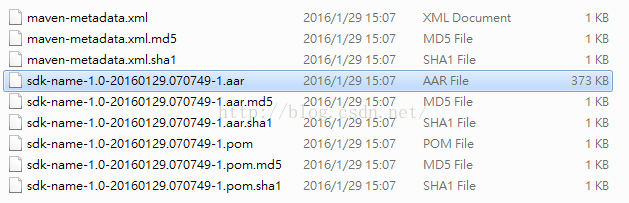

在我们用普通方法对Libray Module进行打包为 test.jar，然后放到libs中使用的过程中，如果Library Module有远程依赖时，我们在使用test.jar的时候就会出现 ClassNotFoundException。因为远程依赖并没有被打包到test.jar中。

## 为什么一定要通过发布Maven库才能访问Library Module的远程依赖
* 首先，我们需要了解打包过程。当我们需要对一个Library Module进行打包的时候，Library项目的远程依赖不会被一起打包到aar或jar文件中。因为打包的过程其实就是对编译出来的class二进制文件进行压缩打包而已，而编译过程下载到本地的远程依赖包一般是在 *Users/username/.gradle/cache/modules-2/files-2.1* 目录下，并不是直接下载到当前工程的目录下的，所以并不会被打包的。
* 然后，我们要知道maven仓库有什么特别的，可以让我们通过compile的设置就能知道已经打包的aar或者jar需要哪些远程依赖。一个maven目录如下

其中，所有Library Module的远程依赖都在.pom文件中，而在主项目就是通过.pom文件来下载这些远程依赖的。
* **结论 :** 所以，要想打包的 Library Module 可以包含依赖，就要把这个 Library Module 发布成一个Maven仓库。通过像其他远程第三库一样，在 app/build.gradle 中配置 compile 'groupId:articleId:version' 来使用。

**注 :** 关于如何查看下的jar和aar文件位置可以在 app/build.gradle 配置脚本代码如下：

```shell
task showMeCache << {
     configurations.compile.each { println it }
 }
```

## 发布Maven仓库

### 发布/使用本地Maven仓库

1. 在 Library_Directory/build.gralde 中加入如下代码,确保 ANDROID_HOME已经配置：

**Note :**
* version   是 Library 版本
* groupId  是 Library 包名
* artifactId 是 Library 名称

```shell
apply plugin: 'maven'

uploadArchives {
    repositories {
        mavenDeployer {
            repository(url: "file://localhost/" + System.getenv("ANDROID_HOME")
                    + "/extras/android/m2repository/")
            pom.version = '1.0-SNAPSHOT'
            pom.groupId = 'your.package'
            pom.artifactId = 'sdk-name'
        }
    }
}
```
2.  完成后，会在如上指定目录URL(/extras/Android/m2repository/...) 中生成相应目录作为本地Maven仓库。

3.因为是在自定义目录下生成的本地Maven仓库，项目默认的 mavenLocal 一般是在 */Users/username/.m2/repository* 下面，所以需要对项目需要Maven仓库进行配置。

代码配置：

*android/build.gradle*
```shell
allprojects {
    repositories {
        mavenLocal()
        jcenter()
        maven {
            // All of React Native (JS, Obj-C sources, Android binaries) is installed from npm
            url "$rootDir/../node_modules/react-native/android"
        }
        maven {
            url "file:///C:/Users/username/AndroidHomePath/extras/android/m2repository"
        }
    }
}
```

4. 配置好了项目Maven仓库的来源，配置上对这个Maven仓库中那个生成的库的依赖就ok了

*android/app/build.gradle*
```shell
dependencies {
    ...
    compile 'groupId:articleId:version'
    ...
}
```
最后，尝试build后，看看Library Module的远程依赖有没有下载到本地就ok

### 发布/使用远程Maven仓库
对于发布远程maven仓库，就有很多选择，可以发布到自己的局域网服务器，中央仓库和Jboss仓库。而发布到私服可以直接选择发布到git上去管理。
对于远程仓库的发布代码如下：
```shell
apply plugin: 'maven'

uploadArchives {
    repositories {
        mavenDeployer {
            repository(url: "http://xxx/xxx")
            pom.version = '1.0-SNAPSHOT'
            pom.groupId = 'your.package'
            pom.artifactId = 'sdk-name'
        }
    }
}
```

使用的时候只需要将 *android/build.gradle* 中 maven 的 url 改成服务器地址就ok。
