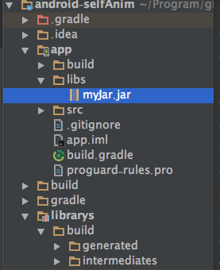

## Library不包含远程库的情况
如果不包含远程库，那么项目在build一次后会在 *Library_Directory/build/intermediates/bundles/release/* 下生成class文件和资源文件。所以可以通过对这些文件的压缩打包来获得jar包或者aar文件
#### 具体做法
1. 在 Library_Directory/build.gralde 中加入如下代码：

```shell
task makeJar(type: Copy) {
    delete 'build/libs/mysdk.jar'
    from('build/intermediates/bundles/release/') //这个路径可以替换成bundles/debug/
    into('build/libs/')
    include('classes.jar')
    rename ('classes.jar', 'mysdk.jar')
}

makeJar.dependsOn(build)
//在终端执行生成JAR包
// gradlew makeJar
```

2. 然后在Terminal中键入 gradlew makeJar 回车看到如下所示就OK了：



3. 在主工程App的build中要加入librarys 这个依赖model
```shell
dependencies {
    ...
    compile fileTree(dir: 'libs', include: ['*.jar'])
    ...
}
```
aar文件做法一样，只是在执行makeJar后会把资源文件一起打包
看makeJar的代码，就是很简单的将 build/intermediates/bundles/release/ 路径下的class文件压缩成一个jar包来使用。而一般build/intermediates/bundles/release/ 下的class文件智慧包含本地代码编译出的class文件，也就是说不包含远程依赖的jar和aar文件。
我们要将一个Library工程完整打包（包含远程依赖），只能通过创建maven仓库，然后在主项目工程中的build.gradle配置进去使用。详情转 "创建和生成本地或远程Maven仓库.md".
